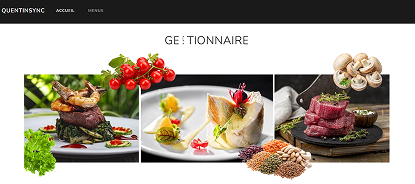

# Projet outil de restauration

Ce fichier `README.md` présente mon projet de fin de second semestre de seconde année de BUT Informatique, développé en Angular.



---

## Sommaire
[1. Liste des fonctionnalités minimales développées](#1-liste-des-fonctionnalités-minimales-développées)  
&emsp;[1.1. Composants](#11-équipe-de-développement)  
&emsp;[1.2. Services](#12-équipe-de-développement)  
&emsp;[1.3. Autre classes](#13-autre-classes)  
[2. Liste des fonctionnalités bonus développées](#2-liste-des-fonctionnalités-bonus-développées)   
[3. Présentation rapide des classes](#3-présentation-rapide-des-classes)  
[4. Routes de l'application](#4-routes-de-lapplication)  

---

## 1. Liste des fonctionnalités minimales développées

* Voir la liste des menus
* Voir le détail d’un menu avec la liste de ses plats
* Pouvoir ajouter un plat dans un menu
* Pouvoir modifier un plat dans un menu
* Pouvoir supprimer un plat d’un menu
* Pouvoir créer un nouveau menu
* Pouvoir modifier un menu
* Pouvoir supprimer un menu (en supprimant bien entendu ses plats en même temps)

## 2. Liste des fonctionnalités bonus développées

* Filtrage des menus actifs ou non
* Enrichir la page de détail d’un menu en affichant le nombre total de calories du menu
* Information pour utilisateur sur l’état du serveur REST

## 3. Présentation rapide des classes

### 3.1 Composants
**_AppComponent_** 
* Description: Composant racine de l'application. 
* Utilisation: Utilisé pour initialiser l'application et inclure le routeur. 
* Fonctionnalité: Affiche le composant de navigation et le contenu des routes.

**_NavigationComponent_**  
* Description: Composant de navigation. 
* Utilisation: Affiché en haut de chaque page pour permettre la navigation entre les 
différentes sections de l'application. 
* Fonctionnalité: Contient des liens vers les pages d'accueil et de gestion des menus.  

**_AccueilComponent_**
* Description: Composant de la page d'accueil. 
* Utilisation: Affiché lorsque l'utilisateur accède à la racine de l'application. 
* Fonctionnalité: Affiche une animation de bienvenue.  

**_MenuListComponent_** 
* Description: Composant pour lister les menus. 
* Utilisation: Affiché sur la page de gestion des menus. 
* Fonctionnalité: Affiche une liste de menus avec des options de filtrage et de 
recherche.  

**_MenuItemComponent_** 
* Description: Composant pour afficher un élément de menu. 
* Utilisation: Utilisé dans MenuListComponent pour afficher chaque menu. 
* Fonctionnalité: Affiche les détails d'un menu et permet de le modifier ou de le 
supprimer.  

**_MenuEditComponent_** 
* Description: Composant pour créer ou modifier un menu. 
* Utilisation: Affiché lors de la création ou de la modification d'un menu. 
* Fonctionnalité: Contient un formulaire pour saisir les détails du menu.   

**_MenuDetailComponent_**
* Description: Composant pour afficher les détails d'un menu. 
* Utilisation: Affiché lorsque l'utilisateur consulte les détails d'un menu. 
* Fonctionnalité: Affiche les informations du menu et la liste des plats associés.  

**_PlatEditComponent_**
* Description: Composant pour créer ou modifier un plat. 
* Utilisation: Utilisé dans MenuDetailComponent pour ajouter ou modifier un plat. 
* Fonctionnalité: Contient un formulaire pour saisir les détails du plat.  

### 3.2 Services

**_MenuService_** 
* Description: Service pour gérer les opérations CRUD sur les menus et les plats. 
* Utilisation: Injecté dans les composants pour effectuer des appels HTTP vers l'API. 
* Fonctionnalité: Fournit des méthodes pour récupérer, ajouter, mettre à jour et 
supprimer des menus et des plats. 

### 3.3 Autre classes

**_Menu_** 
* Description: Modèle de données pour un menu.
* Utilisation: Utilisé pour représenter les menus dans l'application. 
* Fonctionnalité: Contient les propriétés d'un menu telles que l'id, le nom, la 
description, la date de création et le statut.

**_Plat_**
* Description: Modèle de données pour un plat.
* Utilisation: Utilisé pour représenter les plats dans l'application.
* Fonctionnalité: Contient les propriétés d'un plat telles que l'id, le menuId, le nom et 
les calories. 

## 4. Routes de l'application

| **Route**     | **Principe**        |
|----------------------------|-----------------|
| ```/``` | Page d'accueil de l'application |
| ```/menus``` | Affiche la liste des menus |
| ```/menu/new``` | Formulaire pour créer un nouveau menu |
| ```/menu/edit/:id``` | Formulaire pour modifier un menu existant |
| ```/menu``` | Affiche les détails d'un menu et la liste des plats associés |
